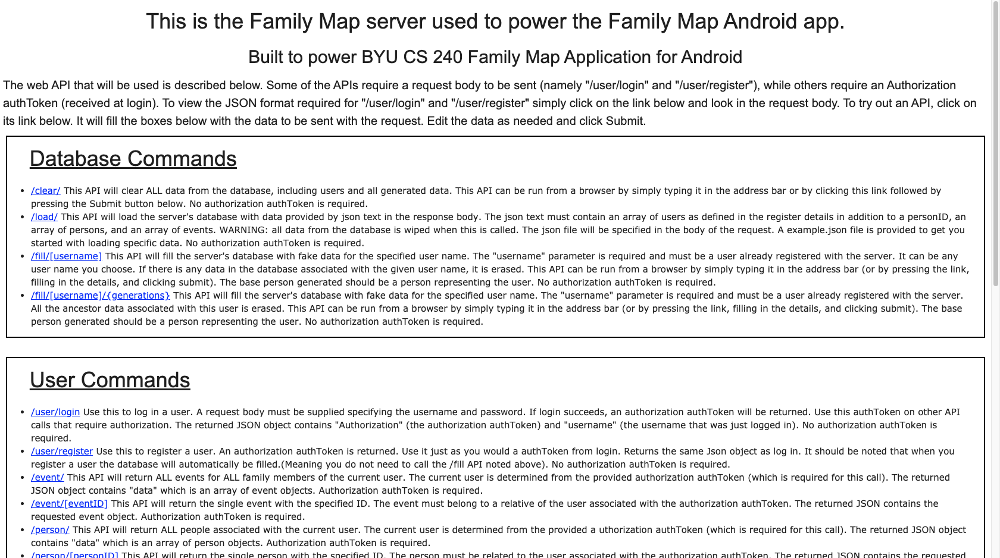
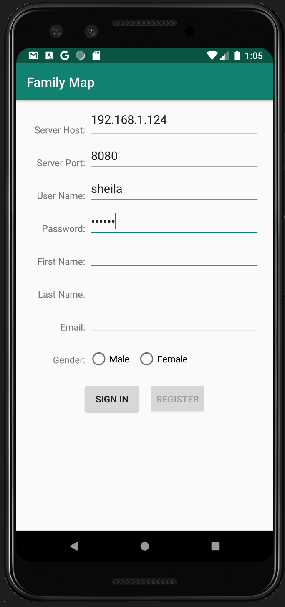

# Family Map

An android app that displays family tree data on an interactive Google Map.
Data is generated randomly or loaded manually in JSON format. The purpose
of this project is to demonstrate profficiency in full-stack development.

 
<i>DISCLAIMER: This project was completed as a part of a Computer Science course at Brigham Young University.
The implementation is based on the provided specification and I do not claim any credit for the project material.</i>
  

Specifications for the project and sample data can be found in ./Getting_Started

## Pre-Requisites
* Install [Android Studio](https://developer.android.com/studio/?gclid=CjwKCAjwvtX0BRAFEiwAGWJyZBN9KQx6_oF0RENjrMMa0yMxHRySpHMvjteQVWSlC34toDA5xPVVURoCxlkQAvD_BwE&gclsrc=aw.ds)

## Server

The server can be run locally in Android Studio simultaneously with the Android emulator.

1. Open the file located at ./server/src/main/java/Server.java and run the 'main' method.
  This can be done by clicking one of the green arrows to the left of the code.

2. Open up a browser and navigate to http://localhost:8080/ to verify the server is running. 
(When the server starts you will see the text <i>"INFO: Listening on port 8080"</i>.
If a different port is indicated, navigate to that port in your browser instead
of 8080).

3. If you see the following screen, your server is running properly.

4. OPTIONAL: Load some sample data. Scroll to the bottom of the page and type the command /load/
in the Handle text field. Next, copy the provided sample data located in ./Getting_Started/data_sample.json 
and paste it into the Request Body field. Click 'Submit'. Now, you can log in with the following credentials
when running the android emulator: username: <i>sheila</i>, password: <i>parker</i>

## Android Client
1. Run the Android Client on an Android Studio emulator. To do this, run the 'client' module.
2. You will be greeted with a login page. You must enter the Server Host IP Address and Port
Number before logging in or registering. This is the same port number used when navigating to the
web page in the browser.

3. You must register as a user before you can log in. If you loaded the sample data outlined in the previous
section, you can log in with those credentials now.
 
After a successfull login, you have free run of the application! Enjoy!
